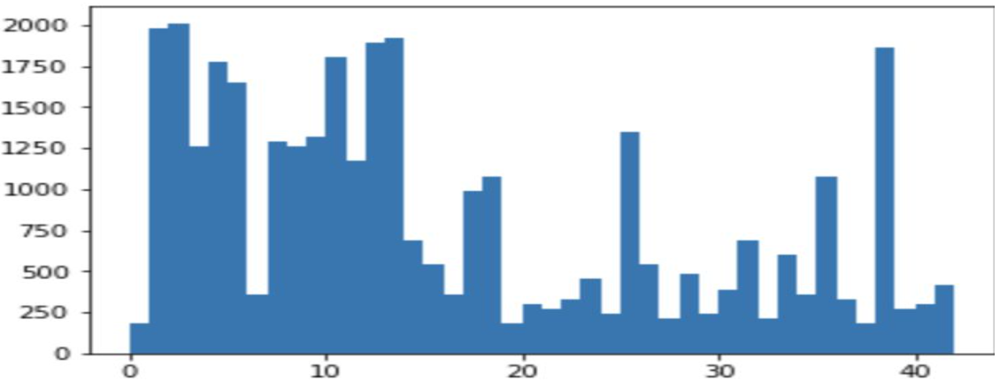
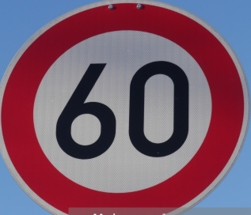
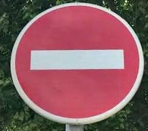

# Traffic​ ​Sign​ ​Recognition​ ​:​ ​Build​ ​a​ ​Traffic​ ​Sign

# Recognition​ ​Project

The​ ​goals​ ​/​ ​steps​ ​of​ ​this​ ​project​ ​are​ ​the​ ​following:
*​ ​Load​ ​the​ ​data​ ​set​ ​(see​ ​below​ ​for​ ​links​ ​to​ ​the​ ​project​ ​data​ ​set)
*​ ​Explore,​ ​summarize​ ​and​ ​visualize​ ​the​ ​data​ ​set
*​ ​Design,​ ​train​ ​and​ ​test​ ​a​ ​model​ ​architecture
*​ ​Use​ ​the​ ​model​ ​to​ ​make​ ​predictions​ ​on​ ​new​ ​images
*​ ​Analyze​ ​the​ ​softmax​ ​probabilities​ ​of​ ​the​ ​new​ ​images
*​ ​Summarize​ ​the​ ​results​ ​with​ ​a​ ​written​ ​report

## Writeup/README

## Data ​Set ​Summary ​& ​Exploration

### 1. ​Provide ​a ​basic ​summary ​of ​ the ​data ​set. ​In the ​code, ​the ​analysis ​should ​be

### done ​using ​python, ​numpy ​and/or ​pandas ​methods ​rather than hardcoding

### results ​manually.

After​ ​reading​ ​the​ ​.pkl​ ​files​ ​I​ ​performed​ ​the​ ​following
Number​ ​of​ ​training​ ​examples​ ​=​ ​ 34799
Number​ ​of​ ​testing​ ​examples​ ​=​ ​ 12630
Image​ ​data​ ​shape​ ​=​ ​(32,​ ​32,​ ​3)
Number​ ​of​ ​classes​ ​=​ ​ 43

### 2. ​ ​ Include ​an ​exploratory ​visualization ​of ​the ​dataset.

### Here​ ​is​ ​an​ ​exploratory​ ​visualization​ ​of​ ​the​ ​data​ ​set.​ ​The​ ​following​ ​bar​ ​chart​ ​shows​ ​the

### frequency​ ​of​ ​training​ ​examples​ ​for​ ​each​ ​of​ ​the​ ​ 43 ​ ​class​ ​labels​ ​(​ ​traffic​ ​signs).


```
The​ ​bar​ ​chart​ ​shows​ ​a​ ​very​ ​uneven​ ​distribution​ ​of​ ​classes.
```

## Design ​ ​ and ​ ​ Test ​ ​ a ​ ​ Model ​ ​ Architecture

I​ ​first​ ​decided​ ​to​ ​standardize​ ​all​ ​the​ ​data​ ​by​ ​converting​ ​it​ ​to​ ​zero​ ​mean​ ​and​ ​unit​ ​variance.​ ​This
alone​ ​did​ ​not​ ​bring​ ​the​ ​accuracy​ ​above​ ​the​ ​minimum​ ​criterion​ ​(​ ​ 93 ​ ​percent).​ ​On​ ​further​ ​reading​ ​I
found​ ​that​ ​this​ ​normalization​ ​technique​ ​is​ ​most​ ​effective​ ​to​ ​remove​ ​the​ ​bias​ ​of​ ​multiple​ ​units​ ​of
measurement​ ​of​ ​the​ ​data.​ ​The​ ​lack​ ​of​ ​improvement​ ​with​ ​this​ ​technique​ ​indicated​ ​that​ ​the​ ​data
was​ ​collected​ ​in​ ​a​ ​consistent​ ​fashion.
Then​ ​I​ ​decided​ ​to​ ​perform​ ​scaling,​ ​​ ​between​ ​-1.0​ ​to​ ​1.0.​ ​This​ ​led​ ​to​ ​an​ ​improvement​ ​in
performance.
After​ ​this​ ​I​ ​read​ ​online​ ​that​ ​brightness​ ​normalization​ ​improves​ ​performance​ ​when​ ​working​ ​with
images​ ​that​ ​are​ ​captured​ ​any​ ​time​ ​during​ ​the​ ​day.

This​ ​did​ ​lead​ ​to​ ​a​ ​substantial​ ​improvement.​ ​I​ ​finally​ ​settled​ ​with​ ​brightness​ ​normalization​ ​and
scaling​ ​between​ ​-0.5​ ​to​ ​0.5.
Since​ ​neural​ ​nets​ ​benefit​ ​from​ ​more​ ​data,​ ​I​ ​also​ ​performed​ ​data​ ​augmentation​ ​by​ ​applying​ ​small
amounts​ ​of​ ​translations,​ ​brightness​ ​changes​ ​and​ ​rotations.​ ​This​ ​also​ ​teaches​ ​the​ ​network​ ​that
the​ ​ideal​ ​function​ ​is​ ​agnostic​ ​to​ ​where​ ​in​ ​the​ ​overall​ ​image​ ​the​ ​traffic​ ​sign​ ​is​ ​present,​ ​its
orientation​ ​and​ ​the​ ​time​ ​of​ ​the​ ​day​ ​it​ ​was​ ​captured.
With​ ​this​ ​augmentation​ ​the​ ​training​ ​data​ ​set​ ​became​ ​ 4 ​ ​times​ ​the​ ​original​ ​size.

I​ ​did​ ​not​ ​make​ ​any​ ​changes​ ​to​ ​the​ ​original​ ​LeNET​ ​architecture​ ​other​ ​than​ ​change​ ​the​ ​input
image​ ​channel​ ​number​ ​to​ ​three​ ​and​ ​the​ ​output​ ​class​ ​number​ ​to​ ​43.​ ​I​ ​also​ ​added​ ​dropout​ ​before
the​ ​last​ ​fully​ ​connected​ ​layer​ ​to​ ​avoid​ ​overfitting.​ ​A​ ​probability​ ​of​ ​0.5​ ​gave​ ​good​ ​accuracy​ ​on​ ​the
test​ ​set.
This​ ​is​ ​a​ ​description​ ​of​ ​the​ ​model​ ​used.
    **Layer Description**
    Input 32x32x3​ ​RGB​ ​image
    Convolution​ ​5x5 1x1​ ​stride,​ ​valid​ ​padding,​ ​outputs​ ​28x28x
    RELU
    Max​ ​pooling​ ​2x2 2x2​ ​stride,​ ​valid​ ​padding,​ ​outputs​ ​14x14x
    Convolution​ ​5x5 1x1​ ​stride,​ ​valid​ ​padding,​ ​outputs​ ​10x10x
    RELU
    Max​ ​pooling​ ​2x2 2x2​ ​stride,​ ​valid​ ​padding,​ ​outputs​ ​5x5x
    Flatten Output​ ​ 400
    Fully​ ​connected Output​ ​ 120
    RELU
    Fully​ ​connected Output​ ​ 84
    RELU

```
Dropout Keep​ ​Probability:​ ​0.
Fully​ ​connected Output​ ​ 43
```

I​ ​used​ ​the​ ​adamOptimizer​ ​which​ ​works​ ​well​ ​because​ ​of​ ​the​ ​inbuilt​ ​momentum.
The​ ​other​ ​hyperparameters​ ​that​ ​I​ ​used​ ​are:
EPOCHS​ ​=​ ​ 20
BATCH_SIZE​ ​=​ ​ 64
Learning​ ​rate​ ​=​ ​0.

My​ ​final​ ​model​ ​results​ ​were:
*​ ​training​ ​set​ ​accuracy​ ​of​ ​​ **0.**
*​ ​validation​ ​set​ ​accuracy​ ​of​ ​​ ​​ **0.**
*​ ​test​ ​set​ ​accuracy​ ​of​ ​​ **0.**
The​ ​validation​ ​accuracy​ ​is​ ​calculated​ ​after​ ​every​ ​epoch​ ​in​ ​cell​ ​“Train,​ ​Validate​ ​and​ ​Test​ ​the
Model”.
The​ ​test​ ​and​ ​training​ ​accuracy​ ​is​ ​in​ ​cell​ ​“Load​ ​and​ ​Output​ ​the​ ​Images”.
I​ ​started​ ​with​ ​the​ ​LeNet​ ​architecture​ ​as​ ​it​ ​is​ ​known​ ​to​ ​perform​ ​well​ ​on​ ​image​ ​data.
My​ ​approach​ ​to​ ​improving​ ​the​ ​performance​ ​was​ ​focused​ ​around​ ​picking​ ​the​ ​right​ ​normalization
technique.
I​ ​also​ ​experimented​ ​with​ ​batch​ ​sizes​ ​of​ ​64,​ ​32,​ ​and​ ​8.​ ​I​ ​did​ ​not​ ​find​ ​any​ ​significant​ ​improvements
with​ ​dropping​ ​the​ ​batch​ ​size.
Further​ ​when​ ​I​ ​noticed​ ​that​ ​the​ ​accuracy​ ​tends​ ​to​ ​jump​ ​around​ ​a​ ​lot,​ ​I​ ​dropped​ ​the​ ​learning​ ​rate
to​ ​0.0005​ ​and​ ​0.0001.​ ​While​ ​these​ ​rates​ ​made​ ​the​ ​training​ ​slower,​ ​they​ ​did​ ​not​ ​help​ ​with​ ​the
fluctuation.
Initially​ ​I​ ​did​ ​not​ ​have​ ​good​ ​results​ ​on​ ​the​ ​test​ ​set​ ​and​ ​thus​ ​decided​ ​to​ ​use​ ​dropout.​ ​A​ ​dropout
param​ ​of​ ​0.5​ ​seems​ ​to​ ​work​ ​well.


However​ ​given​ ​that​ ​the​ ​training​ ​accuracy​ ​is​ ​much​ ​higher​ ​than​ ​the​ ​validation​ ​accuracy,​ ​it​ ​is
possible​ ​that​ ​the​ ​model​ ​has​ ​overfit​ ​on​ ​the​ ​training​ ​data.​ ​However​ ​increasing​ ​the​ ​dropout
parameter​ ​was​ ​not​ ​very​ ​helpful​ ​with​ ​this​ ​problem.

## Test ​a ​Model ​on ​New ​Images

These​ ​are​ ​the​ ​images​ ​I​ ​chose​ ​for​ ​testing.​ ​All​ ​of​ ​these​ ​images​ ​are​ ​challenging​ ​because​ ​of​ ​the
presence​ ​varying​ ​background.







The​ ​model​ ​was​ ​only​ ​able​ ​to​ ​correctly​ ​guess​ ​2 ​​of​ ​the​ ​5 ​​images.​ ​That​ ​gives​ ​it​ ​a​ ​accuracy​ ​of​ ​40
percent.​ ​The​ ​results​ ​indicated​ ​that​ ​the​ ​network​ ​did​ ​not​ ​generalize​ ​properly.
I​ ​believe​ ​this​ ​result​ ​was​ ​much​ ​different​ ​than​ ​the​ ​test​ ​set​ ​as​ ​these​ ​images​ ​were​ ​not
preprocessed.​ ​That​ ​is​ ​the​ ​images​ ​were​ ​not​ ​centred​ ​around​ ​the​ ​traffic​ ​sign​ ​etc.​ ​This​ ​is​ ​indicative
of​ ​the​ ​challenges​ ​one​ ​might​ ​expect​ ​when​ ​running​ ​inference​ ​online.
The​ ​results​ ​were​ ​as​ ​follows:
    **Image** ​ ​ **Number Correct** ​ ​ **label Predicted** ​ ​ **label**
    1 Road​ ​Work Double​ ​Curve
    2 Yield Yiled
    3 Speed​ ​Limit​ ​(60km/h) Go​ ​Straight​ ​or​ ​Left
    4 No​ ​entry No​ ​Entry
    5 Children​ ​crossing Double​ ​Curve

The​ ​softmax​ ​probabilities​ ​are​ ​as​ ​follows:
    **Correct** ​ ​ **label Predicted** ​ ​ **label Highest** ​ ​ **probability All** ​ ​ **softmax**
       **probabilities**
    Road​ ​Work Double​ ​Curve 9.91216421e-01^ [​^ ​​^ ​9.91216421e-01,^
       8.77036247e-03,
       6.60603837e-06,
       3.45797275e-06,
       2.84339308e-06]
    Yield Yiled 1.00000000e+00^ [​^ ​​^ ​1.00000000e+00,^
       7.48112035e-15,
       7.35917114e-18,
       2.39014717e-19,
       1.93508332e-19]
    Speed​ ​Limit​ ​(60km/h) Go​ ​Straight​ ​or​ ​Left 9.99995828e-01^ [​^ ​​^ ​9.99995828e-01,^
       2.23388201e-06,
       1.63432901e-06,
       2.20761322e-07,
       1.10794822e-08]
    No​ ​entry No​ ​Entry 9.98303294e-01^ [​^ ​​^ ​9.98303294e-01,^
       1.66159414e-03,
       2.64457158e-05,
       8.41300698e-06,
       1.05788963e-07]
    Children​ ​crossing Double​ ​Curve 5.61124504e-01^ [​^ ​​^ ​5.61124504e-01,^
       4.01612341e-01,
       2.26115156e-02,
       8.74723401e-03,
       2.64168018e-03]

After​ ​analyzing​ ​the​ ​softmax​ ​probabilities,​ ​it​ ​seems​ ​to​ ​me​ ​that​ ​the​ ​model​ ​is​ ​very​ ​confident​ ​about
its​ ​correct​ ​predictions​ ​as​ ​well​ ​as​ ​the​ ​wrong​ ​ones.​ ​In​ ​the​ ​ones​ ​that​ ​it​ ​classified​ ​incorrectly​ ​I​ ​think​ ​it
made​ ​the​ ​decision​ ​based​ ​on​ ​the​ ​surrounding​ ​of​ ​the​ ​sign​ ​rather​ ​than​ ​the​ ​sign​ ​itself.


